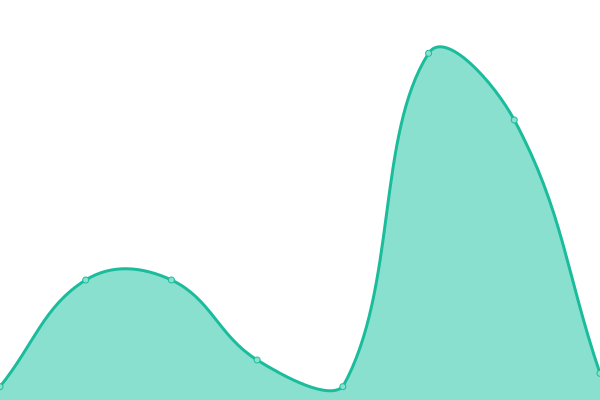

# [📈 Live Status](https://ultreiac.github.io/monitor): <!--live status--> **Todos los sistemas están operativos**

This repository contains the open-source uptime monitor and status page for [ultreiac](https://ultreiac.github.io/monitor), powered by [Upptime](https://github.com/upptime/upptime).

With [Upptime](https://upptime.js.org), you can get your own unlimited and free uptime monitor and status page, powered entirely by a GitHub repository. We use [Issues](https://github.com/ultreiac/monitor/issues) as incident reports, [Actions](https://github.com/ultreiac/monitor/actions) as uptime monitors, and [Pages](https://ultreiac.github.io/monitor) for the status page.

<!--start: status pages-->
<!-- This summary is generated by Upptime (https://github.com/upptime/upptime) -->
<!-- Do not edit this manually, your changes will be overwritten -->
<!-- prettier-ignore -->
| URL | Status | History | Response Time | Uptime |
| --- | ------ | ------- | ------------- | ------ |
|  [Ultreia Web](https://ultreia.es) | 🟩 Up | [ultreia-web.yml](https://github.com/ultreiac/monitor/commits/HEAD/history/ultreia-web.yml) | 

 2745ms
     
 | 

<a href="https://ultreiac.github.io/monitor/history/ultreia-web">0.00%</a>
    

|  [Empleo Ultreia](https://empleo.ultreia.es/) | 🟩 Up | [empleo-ultreia.yml](https://github.com/ultreiac/monitor/commits/HEAD/history/empleo-ultreia.yml) | 

 1050ms
     
 | 

<a href="https://ultreiac.github.io/monitor/history/empleo-ultreia">100.00%</a>
    

|  [Froiz - Web Corporativa](https://froiz.es) | 🟩 Up | [froiz-web-corporativa.yml](https://github.com/ultreiac/monitor/commits/HEAD/history/froiz-web-corporativa.yml) | 

 373ms
     
 | 

<a href="https://ultreiac.github.io/monitor/history/froiz-web-corporativa">100.00%</a>
    

|  [Froiz - Tienda](https://www.froiz.com/shop/) | 🟩 Up | [froiz-tienda.yml](https://github.com/ultreiac/monitor/commits/HEAD/history/froiz-tienda.yml) | 

 809ms
     
 | 

<a href="https://ultreiac.github.io/monitor/history/froiz-tienda">100.00%</a>
    

|  [Ocionorte](https://salapelicano.ocionorte.com/) | 🟩 Up | [ocionorte.yml](https://github.com/ultreiac/monitor/commits/HEAD/history/ocionorte.yml) | 

 1303ms
     
 | 

<a href="https://ultreiac.github.io/monitor/history/ocionorte">100.00%</a>
    

|  [Webmail Ticaas](https://webmail.ticaas.net) | 🟩 Up | [webmail-ticaas.yml](https://github.com/ultreiac/monitor/commits/HEAD/history/webmail-ticaas.yml) | 

 507ms
     
 | 

<a href="https://ultreiac.github.io/monitor/history/webmail-ticaas">100.00%</a>
    

|  [La Ondarresa](https://www.laondarresa.eus) | 🟩 Up | [la-ondarresa.yml](https://github.com/ultreiac/monitor/commits/HEAD/history/la-ondarresa.yml) | 

 2093ms
     
 | 

<a href="https://ultreiac.github.io/monitor/history/la-ondarresa">100.00%</a>
    

|  [MiHogarDigital albarán](https://www.mihogardigital.es) | 🟩 Up | [mi-hogar-digital-albaran.yml](https://github.com/ultreiac/monitor/commits/HEAD/history/mi-hogar-digital-albaran.yml) | 

 2666ms
     
 | 

<a href="https://ultreiac.github.io/monitor/history/mi-hogar-digital-albaran">100.00%</a>
    

|  [El Mar](https://elmar.es) | 🟩 Up | [el-mar.yml](https://github.com/ultreiac/monitor/commits/HEAD/history/el-mar.yml) | 

 2122ms
     
 | 

<a href="https://ultreiac.github.io/monitor/history/el-mar">100.00%</a>
    

|  [Ticaas IMAP (143)](mail.ticaas.net) | 🟩 Up | [ticaas-imap-143.yml](https://github.com/ultreiac/monitor/commits/HEAD/history/ticaas-imap-143.yml) | 

 129ms
     
 | 

<a href="https://ultreiac.github.io/monitor/history/ticaas-imap-143">100.00%</a>
    

|  [Ticaas POP (110)](mail.ticaas.net) | 🟩 Up | [ticaas-pop-110.yml](https://github.com/ultreiac/monitor/commits/HEAD/history/ticaas-pop-110.yml) | 

 129ms
     
 | 

<a href="https://ultreiac.github.io/monitor/history/ticaas-pop-110">100.00%</a>
    

|  [Ticaas SMTP (25)](smtp.ticaas.net) | 🟩 Up | [ticaas-smtp-25.yml](https://github.com/ultreiac/monitor/commits/HEAD/history/ticaas-smtp-25.yml) | 

 129ms
     
 | 

<a href="https://ultreiac.github.io/monitor/history/ticaas-smtp-25">100.00%</a>
    

|  [CF Ticaas DNS 1](kianchau.ns.cloudflare.com) | 🟩 Up | [cf-ticaas-dns-1.yml](https://github.com/ultreiac/monitor/commits/HEAD/history/cf-ticaas-dns-1.yml) | 

 5ms
     
 | 

<a href="https://ultreiac.github.io/monitor/history/cf-ticaas-dns-1">100.00%</a>
    

|  [CF Ticaas DNS 2](naomi.ns.cloudflare.com) | 🟩 Up | [cf-ticaas-dns-2.yml](https://github.com/ultreiac/monitor/commits/HEAD/history/cf-ticaas-dns-2.yml) | 

 5ms
     
 | 

<a href="https://ultreiac.github.io/monitor/history/cf-ticaas-dns-2">100.00%</a>
    

<!--end: status pages-->

[**Visit our status website →**](https://ultreiac.github.io/monitor)

## 📄 License

- Powered by: [Upptime](https://github.com/upptime/upptime)
- Code: [MIT](./LICENSE) © [Anand Chowdhary](https://anandchowdhary.com), supported by [Pabio](https://pabio.com)
- Data in the `./history` directory: [Open Database License](https://opendatacommons.org/licenses/odbl/1-0/)
